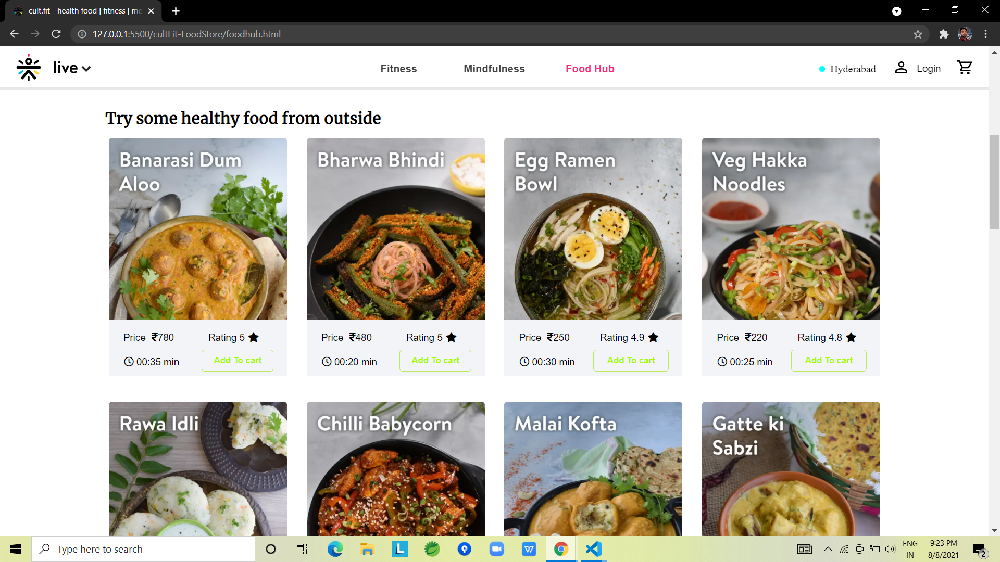

# Cultfit Clone
This project is a complete clone UI with some functionalities of cultfit website like you can make purchase of clothes, foods from here. Used localStorage to save user data, Cart data etc.

## How to run the app
<ul>
  <li>Clone the repo and run the app.</li>
  <ul>
    <li>git clone https://github.com/chandan1499/CultFit_clone.git</li>
    <li>cd Cultfit-project</li>
    <li>Open Home.html page and run it</li>
  </ul>
</ul>

## Built with
<ul>
  <li>HTML</li>
  <li>CSS</li>
  <li>JS</li>
</ul>

## Used libraries
<ul>
  <li>Font awesome</li>
  <li>Google fonts</li>
</ul>

## Screenshots

